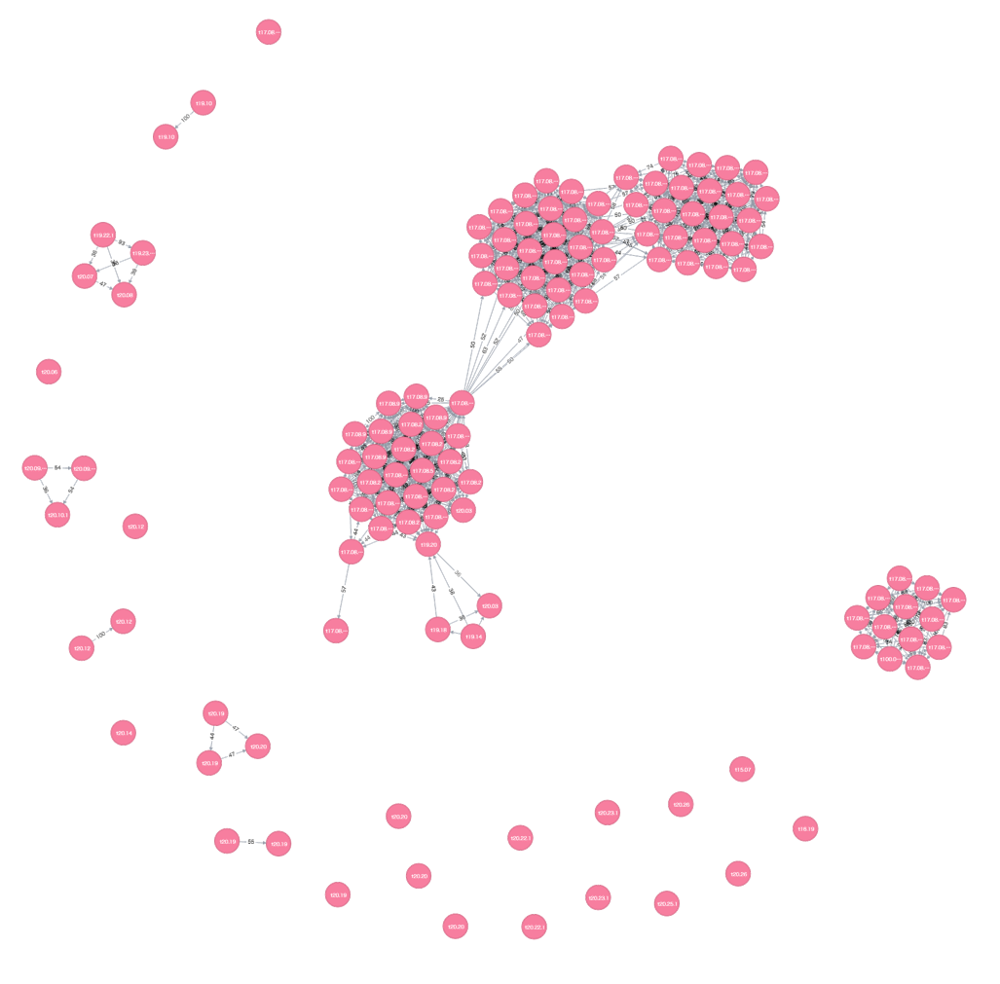

# impfuzzy for Neo4j
  Python script for clustering malware based on fuzzy hash and importing/visualizing the result using Neo4j.

  The following tools and a methods are used:

  [impfuzzy](https://github.com/JPCERTCC/aa-tools/tree/master/impfuzzy) for fuzzy hash calculation.  
  [Neo4j](https://neo4j.com) for a graph database.  
  [The Louvain Method](http://perso.uclouvain.be/vincent.blondel/research/louvain.html) to detect community from large networks.  

  More details are described in the following documents:   
  https://www.jpcert.or.jp/magazine/acreport-impfuzzy_neo4.html (Japanese)   
  
  

## Requirements
  This script requires the following modules:

  * pyimpfuzzy https://github.com/JPCERTCC/aa-tools/tree/master/impfuzzy/pyimpfuzzy
  * py2neo v3 http://py2neo.org/v3/
  * pylouvain.py https://github.com/patapizza/pylouvain

## Usage
1. Download and install [Neo4j community edition](https://neo4j.com/download/).  
2. Start the Neo4j server.  
3. Enter your Neo4j password to impfuzzy_for_neo4j.py  
  ```
  NEO4J_PASSWORD = "{password}"
  ```
4. Import the result of clustering by impfuzzy using impfuzzy_for_neo4j.py  
  Use -h to see help message.  

  * -f - import from file (one EXE or DLL file)
  * -d - import from directory (multiple EXE and/or DLL files)
  * -l - import from csv file (File Name, impfuzzy hash, md5, sha1, sha256)

5. Access http://localhost:7474 via Web browser.  
6. Use Cypher query to see the graph.  

### Cypher Query Examples
#### Visualizing all clusters
```
$ MATCH (m:Malware) RETURN m
```
#### Visualizing clusters that match a specific MD5 hash
```
MATCH (m1:Malware) WHERE m1.md5 = "149925d0d9ab9bf37af1f38dfe9c2af5"
MATCH (m2:Malware) WHERE m2.cluster = m1.cluster

RETURN m2
```
#### Visualizing clusters that match the impfuzzy threshold greater than 90
```
$ MATCH (m:Malware)-[s:same]-() WHERE s.value > 90 RETURN m,s
```
